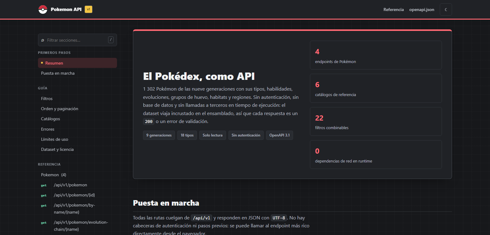

# Pokémon API

<!-- markdownlint-disable MD033 -->
<p align="center"></p>
<!-- markdownlint-enable MD033 -->

[](https://dotnet.microsoft.com/) [](src/PokemonApi.Api/Docs/index.html) [](#endpoints) [](#dataset) [](https://github.com/PokeAPI/pokeapi)

API de solo lectura para explorar Pokémon de las nueve generaciones. El catálogo
se carga desde un archivo JSON incrustado en el ensamblado: **no requiere base de
datos ni realiza llamadas de red durante la ejecución**.

Incluye 1.026 Pokémon, 9 generaciones, 21 tipos, 367 habilidades, 15 grupos de
huevo, 9 hábitats, 9 regiones y 483 relaciones evolutivas. La API no descarga
imágenes; devuelve las URL de los sprites incluidas en los datos.

## Contenido

- [Pokémon API](#pokémon-api)
  - [Contenido](#contenido)
  - [Vista previa](#vista-previa)
  - [Requisitos](#requisitos)
  - [Inicio rápido](#inicio-rápido)
  - [Despliegue](#despliegue)
  - [Documentación](#documentación)
  - [Endpoints](#endpoints)
  - [Filtros, orden y paginación](#filtros-orden-y-paginación)
  - [Errores y límites](#errores-y-límites)
  - [Pruebas](#pruebas)
  - [Dataset](#dataset)
  - [Arquitectura](#arquitectura)

## Vista previa



## Requisitos

- .NET SDK 9.0.318 o posterior dentro de la línea 9.0. La versión mínima está
  fijada en `global.json`.
- Node.js 18 o posterior, solo para regenerar o auditar el dataset.

## Inicio rápido

Desde la raíz del repositorio, restaura y ejecuta la API:

```powershell
dotnet restore PokemonApi.sln
dotnet run --project src/PokemonApi.Api/PokemonApi.Api.csproj --launch-profile http
```

El perfil `http` escucha en `http://localhost:5001`. El perfil `https` está
disponible en `https://localhost:7126` y también configura HTTP en el puerto
5001.

Prueba algunos recursos con `curl`:

```bash
curl "http://localhost:5001/api/v1/pokemon?types=fire&pageSize=3"
curl "http://localhost:5001/api/v1/pokemon/25"
curl "http://localhost:5001/api/v1/pokemon/by-name/pikachu"
curl "http://localhost:5001/api/v1/pokemon/evolution-chain/pichu"
curl "http://localhost:5001/health"
```

En Windows PowerShell puedes usar `curl.exe` para evitar el alias `curl` de
PowerShell.

Si la compilación informa que no puede copiar una DLL porque está en uso, detén
la instancia anterior de la API con `Ctrl+C` en el terminal donde se inició y
vuelve a ejecutar el comando.

## Despliegue

El repositorio incluye un `Dockerfile` multi-stage para .NET 9. Usa el puerto
`PORT` proporcionado por la plataforma y escucha en `0.0.0.0`, por lo que sirve
en Render y Railway sin configurar un puerto fijo.

1. Sube el repositorio a GitHub.
2. En Render, crea un **New > Web Service** y conecta el repositorio.
3. Deja la raíz del proyecto como `.`; selecciona **Docker** y el archivo
  `Dockerfile` en la raíz.
4. Elige el plan **Free**, define el health check como `/health` y crea el
  servicio.
5. Al terminar el despliegue, abre `https://<nombre>.onrender.com/docs/`.

Render es la opción más directa si quieres empezar sin pagar. En su nivel gratis
el servicio se suspende tras 15 minutos sin tráfico y la primera petición puede
tardar cerca de un minuto mientras vuelve a arrancar. El almacenamiento local
es efímero, pero esta API no necesita persistencia: el dataset está incrustado
en el ensamblado.

Para Railway, crea un proyecto desde GitHub; detectará el `Dockerfile` en la
raíz. En el servicio, abre **Settings > Networking > Public Networking** y
selecciona **Generate Domain**. El plan Free ofrece actualmente $1 mensual de
crédito de uso; la prueba inicial ofrece $5 durante 30 días. Revisa el consumo
en [precios de Railway](https://railway.com/pricing), porque el crédito puede
no cubrir un servicio activo todo el mes.

## Documentación

- Interfaz interactiva: [http://localhost:5001/docs/](http://localhost:5001/docs/)
- Especificación OpenAPI: [http://localhost:5001/openapi.json](http://localhost:5001/openapi.json)
- Salud de la API y del dataset: [http://localhost:5001/health](http://localhost:5001/health)

La página `/docs/` está incluida en el ensamblado y disponible junto con la API;
no depende de Swagger, CDN ni archivos externos para cargarse.

## Endpoints

Todos los endpoints de consulta usan `GET` y devuelven JSON.

| Ruta | Descripción |
| --- | --- |
| `/api/v1/pokemon` | Lista Pokémon con filtros, orden y paginación. |
| `/api/v1/pokemon/{id}` | Obtiene el detalle por identificador de la Pokédex. |
| `/api/v1/pokemon/by-name/{name}` | Obtiene el detalle por nombre canónico. |
| `/api/v1/pokemon/evolution-chain/{name}` | Obtiene la cadena evolutiva completa. |
| `/api/v1/generations` | Lista generaciones, regiones y recuentos. |
| `/api/v1/types` | Lista los tipos y sus recuentos. |
| `/api/v1/abilities` | Lista habilidades; permite filtrar por `name` e `isMainSeries`. |
| `/api/v1/egg-groups` | Lista los grupos de huevo. |
| `/api/v1/habitats` | Lista hábitats y recuentos. |
| `/api/v1/regions` | Lista las regiones del catálogo. |
| `/health` | Comprueba el estado de la aplicación y del dataset. |

El nombre tiene una ruta explícita (`/by-name/{name}`) para que no compita con
rutas literales como `/evolution-chain/...`.

## Filtros, orden y paginación

Todos los parámetros de `/api/v1/pokemon` son opcionales. Los filtros de campos
distintos se combinan con **AND**; varios valores del mismo filtro se combinan
con **OR**. Los valores múltiples se pueden repetir o separar por comas:

```text
GET /api/v1/pokemon?types=fire,water&regions=kanto&page=1&pageSize=20
```

Los filtros disponibles son:

| Parámetros | Uso |
| --- | --- |
| `name` | Coincidencia parcial por nombre. |
| `types`, `abilities`, `regions`, `eggGroups`, `habitats` | Uno o varios valores de catálogo. |
| `generation`, `generations` | Una o varias generaciones, por número o slug, por ejemplo `3` o `generation-iii`. |
| `rarity` | Rareza de la especie. |
| `minHeight`, `maxHeight` | Límites de altura en metros. |
| `minWeight`, `maxWeight` | Límites de peso en kilogramos. |
| `minBaseExperience` | Experiencia base mínima. |
| `minTotalStats`, `maxTotalStats` | Límites para la suma de estadísticas base. |
| `minStat`, `minStatValue` | Filtra por una estadística y su valor mínimo. |
| `sortBy`, `sortDirection` | Campo y dirección del orden. |
| `page`, `pageSize` | Página y tamaño; predeterminado 1 y 20, máximo 100. |

Direcciones admitidas: `asc`, `desc`, `ascending` y `descending`. Los valores
de catálogo desconocidos se rechazan con `400`; una página fuera del rango
devuelve `200`, una lista `items` vacía y `hasNextPage: false`.

## Errores y límites

Los errores usan `application/problem+json` (RFC 7807) e incluyen un código
estable en `code`, un tipo URN en `type` y el identificador `traceId` para
correlacionar la respuesta con los logs.

| Código | HTTP | Significado |
| --- | --- | --- |
| `request.validation_failed` | 400 | Uno o más filtros no cumplen las reglas. |
| `request.malformed_parameter` | 400 | Un parámetro no se puede convertir al tipo esperado. |
| `pokemon.not_found` | 404 | No existe el Pokémon solicitado. |
| `rate_limit.exceeded` | 429 | Se superó el límite de peticiones. |
| `server.unexpected_error` | 500 | Error inesperado; el detalle se conserva en el log. |

La limitación es por dirección IP y usa ventanas fijas de un minuto: 120
peticiones para los endpoints de Pokémon y 300 para los catálogos. Una respuesta
`429` incluye la cabecera `Retry-After` y la propiedad `retryAfterSeconds`.

## Pruebas

Ejecuta las pruebas de la solución desde la raíz:

```bash
dotnet test PokemonApi.sln
```

- `tests/PokemonApi.UnitTests`: dominio, filtros, validadores, unidades y casos
  de uso.
- `tests/PokemonApi.IntegrationTests`: endpoints, errores, límites y contrato
  OpenAPI mediante `WebApplicationFactory`.

## Dataset

El archivo versionado `src/PokemonApi.Infrastructure/Data/pokemon.json` es la
fuente de datos de la API y se incrusta en el ensamblado. Para regenerarlo se
necesita conexión a internet; el proceso consulta PokeAPI mediante GraphQL y
REST:

```bash
node tools/build-dataset.mjs src/PokemonApi.Infrastructure/Data/pokemon.json
```

Para inspeccionar los valores y tipos presentes en el dataset local, sin usar
la red:

```bash
node tools/audit-dataset.js
```

Los datos proceden de [PokeAPI](https://github.com/PokeAPI/pokeapi), bajo
licencia BSD-3-Clause. La API publica las URL de sprites como datos y no solicita
las imágenes.

## Arquitectura

La solución separa el dominio, los casos de uso, la infraestructura y HTTP:

```text
PokemonApi.Api -> PokemonApi.Infrastructure -> PokemonApi.Application -> PokemonApi.Domain
```

- `PokemonApi.Domain`: entidades, objetos de valor y reglas independientes de
  frameworks.
- `PokemonApi.Application`: consultas, validación y traducción de filtros.
- `PokemonApi.Infrastructure`: carga del dataset y acceso en memoria.
- `PokemonApi.Api`: endpoints, composición de servicios y respuestas HTTP.

La validación se ejecuta en la cadena de casos de uso, no dentro de cada
endpoint. `ProblemFactory` centraliza la traducción de errores de dominio a
respuestas HTTP.
